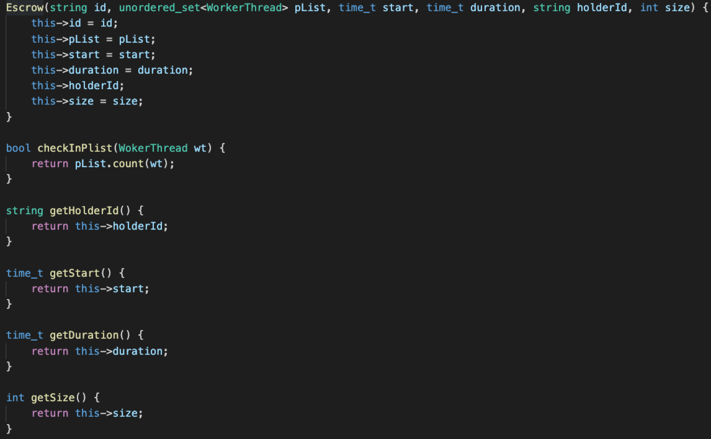

# 目前修改进度

## 创建Escrow类，
- 包含deal id, start time, duration time(原文中的delta)，持有者id，目标人id，物品id，物品数量，party list。
- 封装结果

## 修改worker_thread_pbft.cpp文件
- 设计交易方class的时候，我们直接将worker thread class作为交易方。
- Workthread类添加属性：当前持有物品id，当前持有物品数量，当前Escrow
- 目前将所有和View change相关的属性全部删除，因为timelock中不需要这种机制
- 将全项目所有和投票相关的阈值全部改为所有replica都必须通过

## 修改message class
- 在message的base class当中，
    - 直接将当前的txn_id作为timelock protocol中的deal id
    - 添加当前交易的party list，类型为vector<uint64_t>
    - 添加voter属性，默认值为-1，在最终投票过程中，若投yes，则voter=n（n为当前参与者replica的编号），如果不投或者投no，则为-1
    - 添加broadcast，属性vector<Escrow>。作用是充当market broadcast中报价的部分。

## 待解决
- 有比较多bug需要修正
- 将项目改为sharding版本
- 修改worker thread中第二步primary node发送消息给其余所有replica的步骤，这一步在timelock protocol中应该是由client进行发送